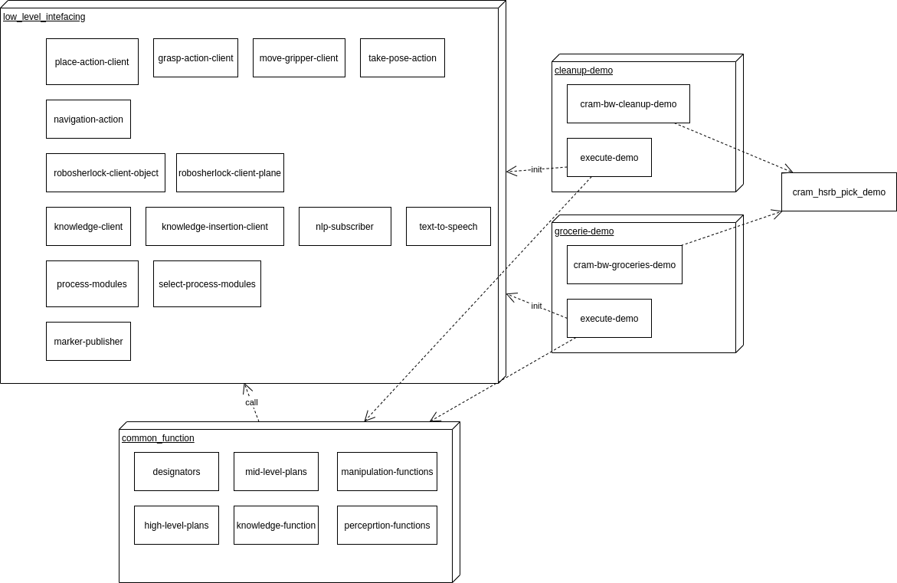

# planning
Repository for planning code

##Setting up the repository
###If you don't have ROS:
1. sudo sh -c 'echo "deb http://packages.ros.org/ros/ubuntu xenial main" > /etc/apt/sources.list.d/ros-latest.list'
2. sudo apt-key adv --keyserver 'hkp://keyserver.ubuntu.com:80' --recv-key C1CF6E31E6BADE8868B172B4F42ED6FBAB17C654
3. sudo apt-get update
4. sudo apt-get install ros-melodic-desktop-full
5. sudo rosdep init
6. rosdep update
7. sudo apt-get install python-catkin-tools
8. echo "source /opt/ros/melodic/setup.bash" >> ~/.bashrc
9. source ~/.bashrc
10. sudo apt install python-rosinstall python-rosinstall-generator python-wstool build-essential
###If you have ROS already installed:
1. rosdep update
2. sudo apt-get install ros-melodic-roslisp-repl
3. sudo apt-get install python-rosinstall python-wstool
4. mkdir -p planning_ws/src
5. cd ~/planning_ws
6. catkin build
7. source devel/setup.bash
8. cd src
9. wstool init
10. wstool merge https://raw.githubusercontent.com/cram2/cram/master/cram-18.04.rosinstall
11. wstool update
12. touch iai_maps/iai_dlr_cutting_demo/CATKIN_IGNORE
13. cd ..
14. rosdep install --ignore-src --from-paths src/ -r
15. cd src && rm -rf cram
16. git clone https://github.com/Plexiglas/cram -b boxy-melodic
17. git clone https://github.com/SUTURO/suturo_resources
18. git clone https://github.com/Plexiglas/snap_map_icp
19. git clone https://github.com/Plexiglas/hsr_navigation
20. git clone https://github.com/ToyotaResearchInstitute/hsr_meshes
21. git clone https://github.com/ToyotaResearchInstitute/hsr_description
22. Follow 6.2.1.3.2 Installation of the HSR simulator at https://docs.hsr.io/hsrb_user_manual_en/howto/pc_install.html 
23. catkin build

## Overview over how to launch everything
### Start the HSR:
Plug in the power supply for the HSR.
Plug the PS2 controller into the USB port.(optional)
Check the switches on the right. Turn them both on.
Press the huge power button for a couple seconds.

From remote: connect to the Alienware via ssh:
ssh suturo@192.168.237
suturo19

Open a byobu session:
byobu

You can now start the launchfiles. Here's a cheat sheet for byobu:
F2 open a new terminal
CTRL-D close current terminal
F6 disconnect from byobu without killing the session
F3/F4 go to terminal left/right
F8 rename the current terminal

### Start behaviour with repl:
####Perform ros-load-system on following packages:
- (swank:operate-on-system-for-emacs "cram-urdf-bringup" (quote load-op))
- (swank:operate-on-system-for-emacs "cram-object-knowledge" (quote load-op))
- (swank:operate-on-system-for-emacs "cram-hsrb-description" (quote load-op)) 
- (swank:operate-on-system-for-emacs "low-level-interfacing" (quote load-op)) 
- (swank:operate-on-system-for-emacs "common-functions" (quote load-op)) 
- (swank:operate-on-system-for-emacs "cram-hsrb-pick-demo" (quote load-op))
- (swank:operate-on-system-for-emacs "cleanup-demo" (quote load-op)) or
(swank:operate-on-system-for-emacs "grocery-demo" (quote load-op))

####Run:
- (clean::init-interfaces) 

